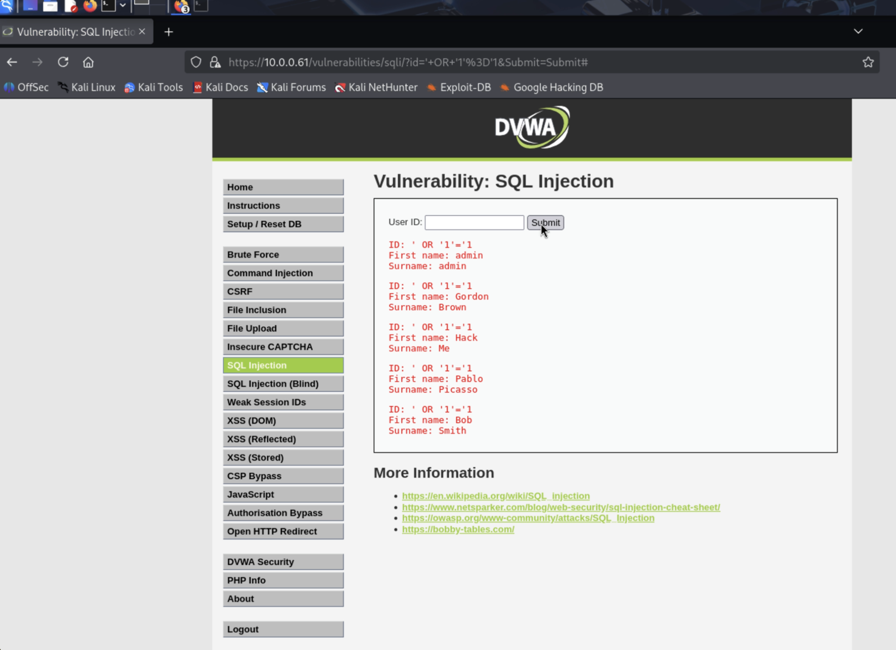
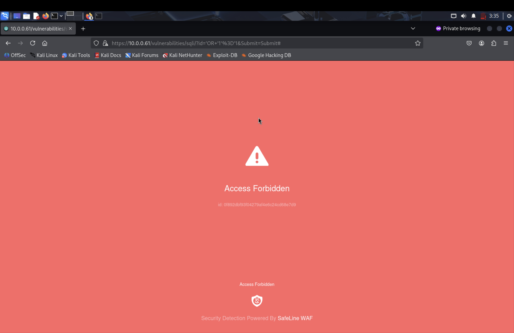

# SafeLine WAF Lab – Detecting and Blocking Web Attacks

## Overview

In this project, I built a home lab to understand how common web attacks work and how a Web Application Firewall (WAF) can detect and block them.

I deployed DVWA (Damn Vulnerable Web Application) on an Ubuntu server and used Kali Linux to simulate attacks such as SQL injection, XSS, and HTTP flood attempts. I then configured SafeLine WAF to inspect and filter malicious traffic before it reached the application.

## Lab Setup

- Host machine: MacBook M4 Pro running Parallels Desktop
- Victim VM: Ubuntu Server 22.04
- Attacker VM: Kali Linux
- Vulnerable application: DVWA running on Apache + MariaDB
- WAF: SafeLine WAF
- Network: Bridged networking

## Attacks Simulated

### SQL Injection
- Payload used: `' OR '1'='1`
- Result without WAF: Successfully returned all users
- Result with WAF: Blocked with 403 response

### Cross-Site Scripting (XSS)
- Reflected XSS payload tested
- Result: Blocked by SafeLine

### HTTP Flood
- Repeated rapid requests sent from Kali
- Result: IP temporarily blocked

## Security Controls Configured

- HTTP Flood Defense
- Custom authentication rule
- Custom deny rule
- SQL Injection protection
- XSS protection

## Key Takeaways

- I saw how real web attacks behave in a controlled lab
- I learned how a WAF works as a reverse proxy
- I configured multiple SafeLine protections
- I reviewed logs showing blocked requests, source IPs, and matched rules
- This lab helped me understand work that is relevant to SOC analysis and alert triage

## Screenshots

### DVWA Login

### DVWA Dashboard

### SafeLine Installation

### Protected Application Setup

### Security Rules

### SQL Injection Success

### WAF Block Page

### WAF Logs

## Project Report

[View the full PDF report](./SafeLine-WAF-Home-Lab-Project.pdf)

## Next Steps

- Forward SafeLine logs to a SIEM such as Splunk
- Create detection rules and alerts
- Expand the lab with more attack scenarios

## Author

Ronak  
Aspiring SOC Analyst
