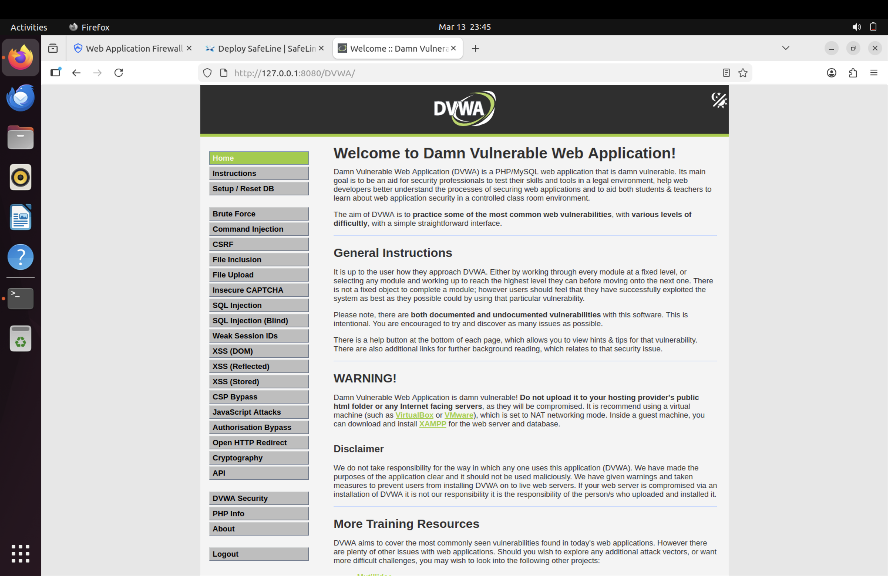
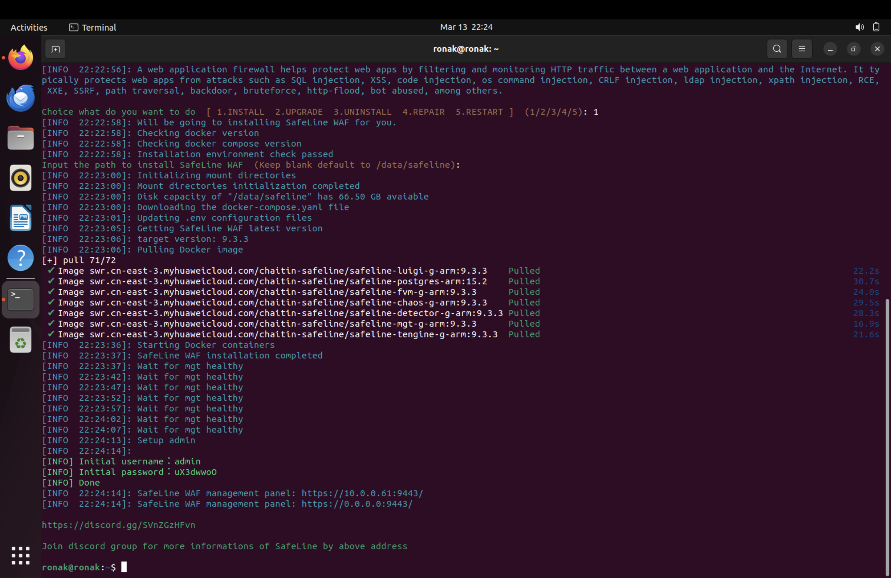
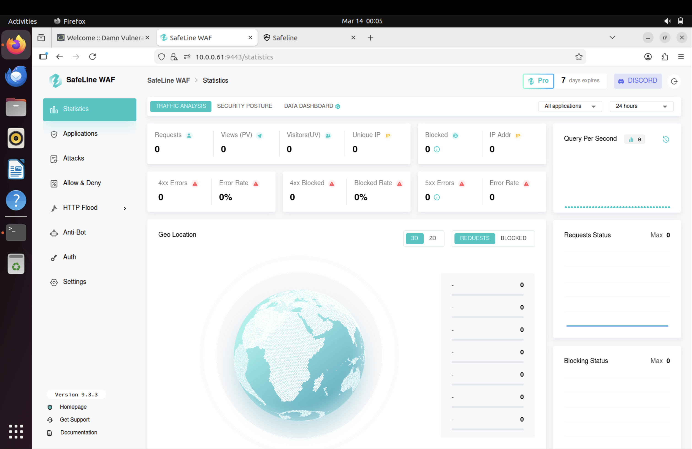
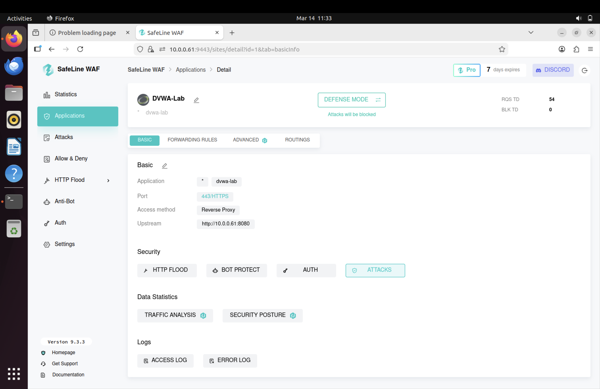
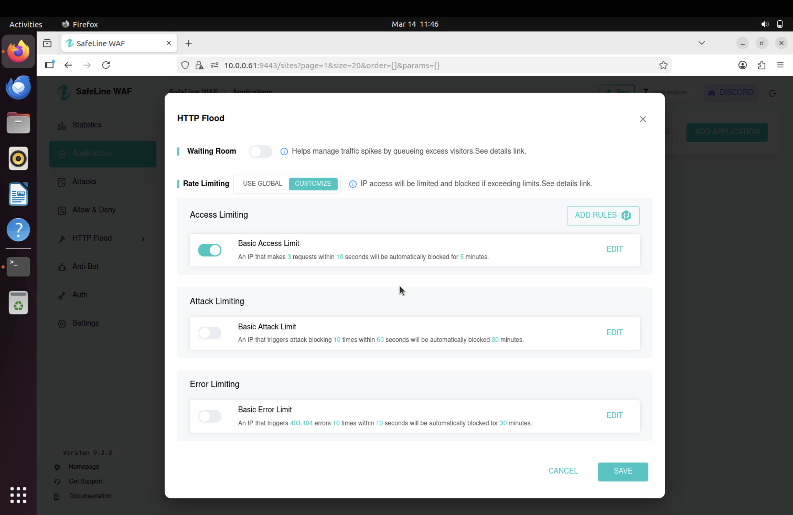
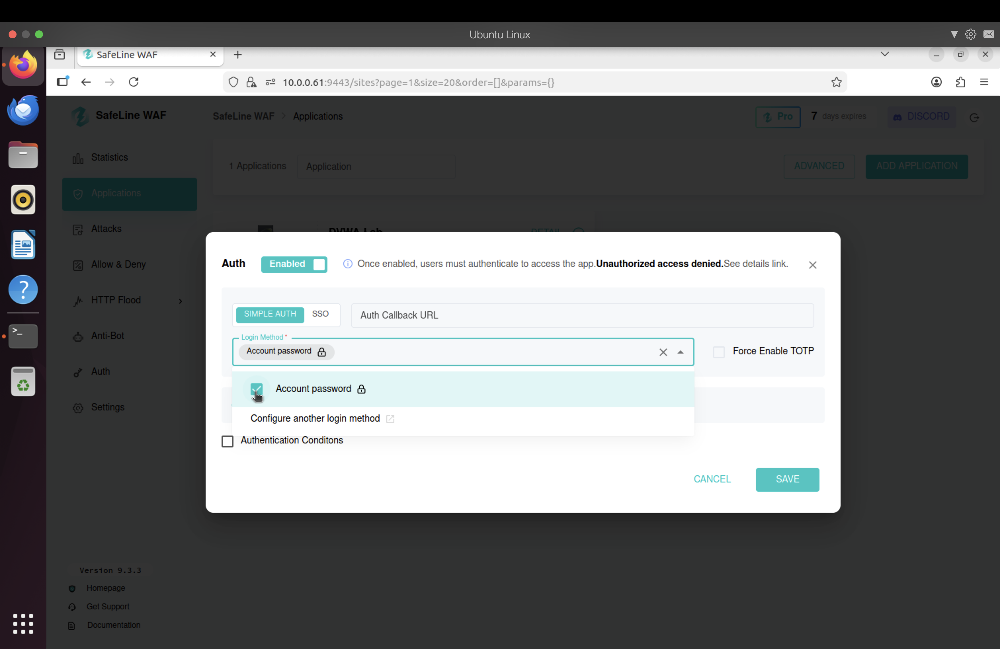
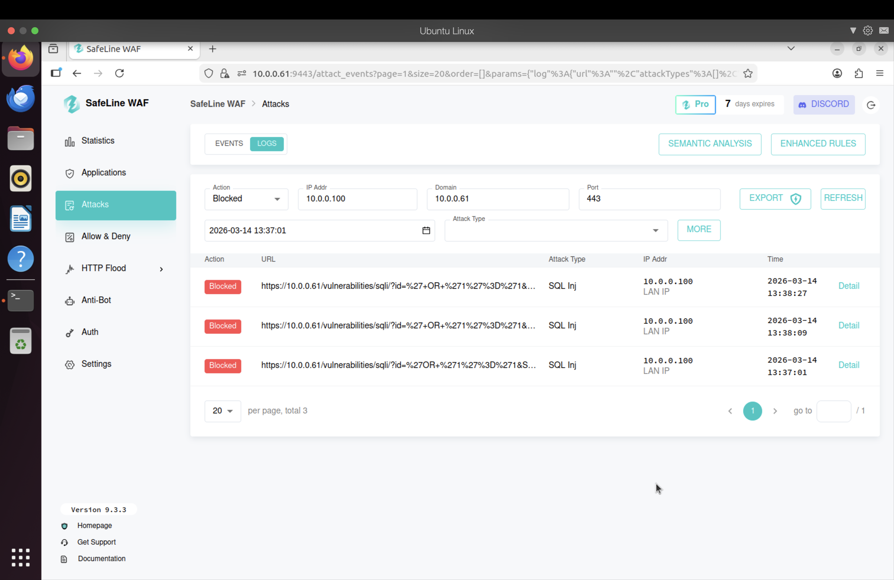
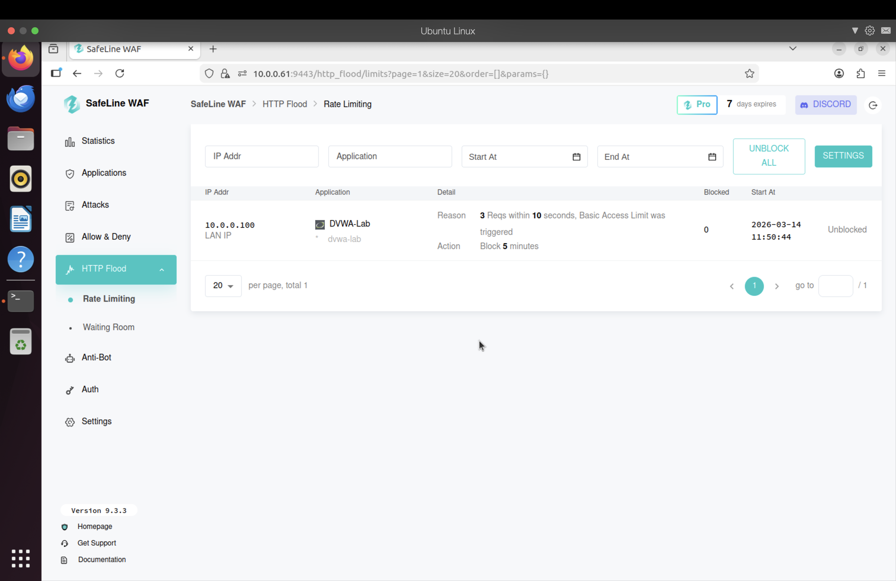
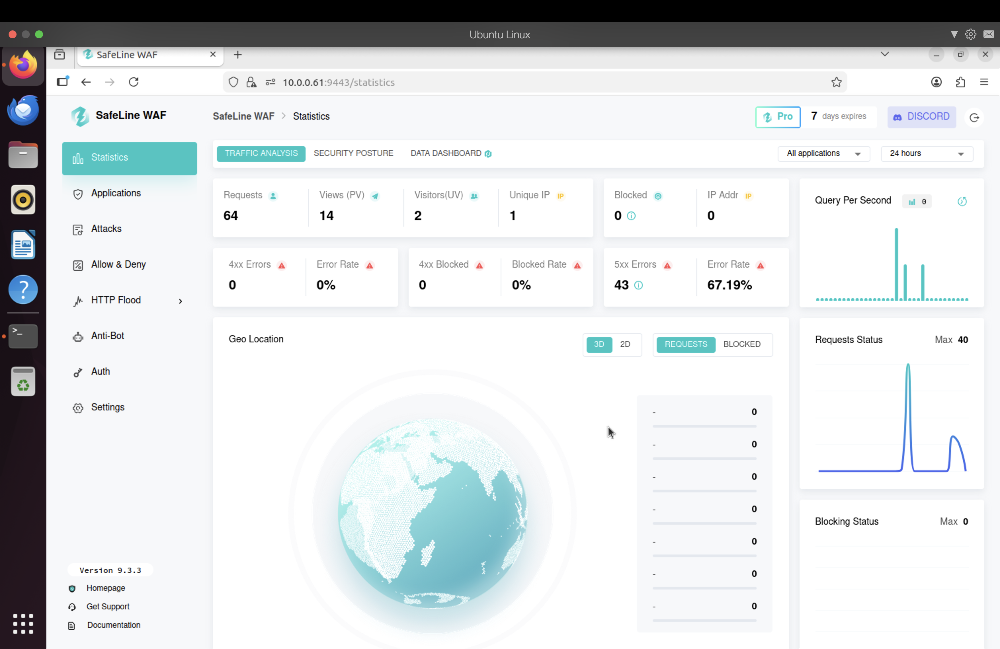

# SafeLine WAF Lab – Detecting and Blocking Web Attacks

## Overview

In this project, I built a home lab to understand how real web attacks work and how a Web Application Firewall (WAF) can detect and block them.

I deployed DVWA (Damn Vulnerable Web Application) on an Ubuntu server and used a Kali Linux machine to simulate attacks like SQL Injection, Cross-Site Scripting (XSS), and HTTP flood attempts.

After confirming the vulnerabilities, I configured SafeLine WAF in front of the application to monitor and filter malicious traffic.

---

## Lab Setup

- Host Machine: MacBook M4 Pro (Parallels Desktop)
- Victim VM: Ubuntu Server 22.04
- Attacker VM: Kali Linux
- Vulnerable Application: DVWA (Apache + MariaDB on port 8080)
- WAF: SafeLine (Docker-based)
- Network: Bridged

---

## DVWA Deployment

I installed a LAMP stack on Ubuntu and deployed DVWA. During setup, I encountered database permission issues but resolved them by fixing MariaDB user privileges and resetting the database.

Once everything was working, I set the DVWA security level to **Low** for testing.

### DVWA Homepage

---

## SafeLine Installation

I installed SafeLine WAF using the official script, which automatically deployed Docker containers and the management interface.

### Installation Output

---

## SafeLine Dashboard (Initial State)

After installation, I accessed the dashboard and confirmed that no traffic was being blocked yet.

---

## Application Configuration

I configured DVWA inside SafeLine so it could act as a reverse proxy and inspect traffic before forwarding it to the backend server.

---

## Security Rules Configuration

I enabled multiple protection mechanisms to simulate real-world defenses.

### HTTP Flood Protection

### Authentication / Deny Rule

---

## Attack Simulation

### SQL Injection (Without Protection)

I tested a simple SQL injection payload:

' OR '1'='1

This successfully bypassed authentication and returned all users from the database.

---

## WAF Protection Enabled

After enabling SafeLine protections, I repeated the same attacks.

### Results

- SQL Injection → Blocked (403 response)
- XSS → Blocked
- HTTP Flood → IP temporarily blocked
- Custom deny rule → Immediate block

### WAF Block Page

---

## Logs & Detection

After the attack was blocked, I reviewed the SafeLine dashboard to analyze detection details.

The logs showed:

- Source IP
- Payload
- Detection rule
- Timestamp
- Action taken

### HTTP Flood Logs

---

## Dashboard After Attacks

The SafeLine dashboard reflected the blocked traffic and attack activity.

---

## Key Takeaways

- I saw how real web attacks like SQL injection and XSS are executed
- Learned how a WAF works as a reverse proxy
- Configured rate limiting, IP blocking, and authentication rules
- Analyzed logs showing attack detection and blocking
- Gained practical experience relevant to SOC analysis

---

## SOC Relevance

This lab simulates real-world SOC scenarios:

- Detecting SQL injection attempts
- Investigating blocked requests
- Analyzing WAF logs
- Identifying suspicious IP activity

---

## Full Project Report

You can view the full detailed documentation here:

[SafeLine WAF Lab Report](./SafeLine-WAF-Home-Lab-Project.pdf.png)

---

## Next Steps

- Forward logs to a SIEM (Splunk / ELK)
- Create alert rules
- Expand with additional attack scenarios

---

## Author

Ronak  
Aspiring SOC Analyst
